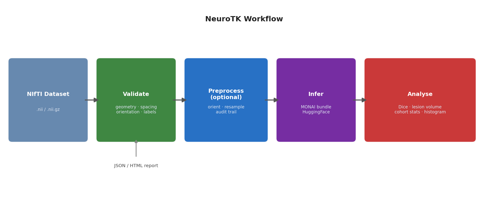

# Abstract

NeuroTK is an open-source Python toolkit for dataset validation and quality
assurance in neurology brain imaging. It operates on NIfTI files [@nifti] and
detects inconsistencies in image geometry, voxel spacing, orientation, affine
matrices, and annotation completeness. Validation results are emitted as
structured JSON reports and optional HTML summaries. NeuroTK additionally
provides deterministic preprocessing (orientation normalization and voxel
resampling), MONAI bundle inference [@monai], and lesion volume analysis.
The software is intended for researchers preparing imaging datasets for
reproducible analysis, benchmarking, or public release, and is distributed
via PyPI and archived at https://doi.org/10.5281/zenodo.18252017.



# Introduction

Brain imaging datasets used in neurology research are frequently heterogeneous.
Differences in scanners, acquisition protocols, reconstruction pipelines, and
clinical workflows produce inconsistencies in voxel spacing, orientation, affine
matrices, and annotation completeness across a single cohort. These issues are
typically discovered late in analysis pipelines — after model development or
statistical analysis has begun — at which point remediation is costly and
reproducibility is compromised.

Widely used medical imaging frameworks such as MONAI [@monai], nnU-Net
[@isensee2021nnu], and SimpleITK-based pipelines [@simpleitk] are primarily
optimized for downstream modeling tasks. Validation logic in these tools is
typically implicit, embedded within preprocessing or data loading code, and
tightly coupled to specific modeling assumptions. There is no standard,
model-agnostic toolkit that treats dataset validation as a first-class,
independently documented research task.

NeuroTK addresses this gap. It provides a lightweight, standalone toolkit
focused on explicit inspection, reporting, and controlled standardization of
NIfTI brain imaging datasets. The tool is model-agnostic and produces
machine-readable artifacts that can be included in supplementary materials,
referenced in data availability statements, or used as entry points for
continuous integration in dataset release workflows. NeuroTK has been used in
the preparation of CT imaging cohorts for traumatic brain injury segmentation
research [@rathi2026tbi] and as a complement to tools such as BLAST-CT
[@monteiro2020] for post-inference quality checks.

# Implementation and Architecture

NeuroTK is implemented in Python (>=3.8) and structured around three core
principles: deterministic behavior, explicit separation of concerns, and
auditability. File I/O relies on NiBabel [@nibabel] for robust cross-platform
NIfTI support. The toolkit exposes both a command-line interface (CLI) and a
Python API.

## Validation

The `validate` command inspects directories of NIfTI image and label files,
checking each file for readability, image geometry, voxel spacing, orientation
code, affine matrix consistency, and label annotation presence. Files are paired
by filename. Results are aggregated into a structured JSON report:

```json
{
  "summary": {"num_images": 100, "files_with_issues": 7},
  "files": {
    "case_001.nii.gz": {"issues": ["label_missing"], "spacing": [1.0, 1.0, 1.0]}
  }
}
```

An optional HTML report (`--html`) renders the same information in a
human-readable format suitable for sharing with collaborators or including in
data release documentation.

## Preprocessing

The `preprocess` command performs orientation normalization and voxel spacing
resampling. All transformations are recorded in the output JSON report alongside
the original metadata, producing a full audit trail. Preprocessing is explicitly
invoked by the user and does not modify original files. NeuroTK avoids
heuristic preprocessing and learning-based methods to preserve interpretability.

## Inference and Analysis

NeuroTK supports inference via external MONAI bundles [@monai], including
automatic download from Hugging Face Hub. Post-inference utilities include Dice
score computation, lesion volume quantification (mL), cohort stratification
statistics, and histogram generation. These are accessible via the CLI or
Python API and are designed to integrate into automated research pipelines.

## Interfaces

NeuroTK provides three interaction modes:

- **CLI**: the primary interface for batch and pipeline use (`neurotk validate`,
  `neurotk preprocess`, `neurotk infer`, `neurotk dice`, `neurotk lesion-volume`)
- **Python API**: all CLI commands are importable functions for programmatic use
- **Web UI**: a FastAPI-based web application for interactive use without
  command-line knowledge, supporting single-dataset upload and report generation

A Dockerfile is provided for containerized deployment. Installation requires
only `pip install neurotk`; inference extras are opt-in via
`pip install neurotk[inference]`.

# Quality Control

NeuroTK includes a test suite of 13 test modules covering all major subsystems:
validation, preprocessing, inference, lesion volume analysis, cohort statistics,
CLI behaviour, HTML report generation, and web application commands. Tests are
implemented using pytest and use synthetic NIfTI fixtures generated at test time,
ensuring reproducibility across environments without requiring external data.

Key test coverage areas include:

- **Validation correctness**: verified against datasets with missing labels,
  corrupt NIfTI files, spacing inconsistencies, and orientation mismatches
- **Preprocessing determinism**: outputs verified to match expected spacing and
  orientation for fixed inputs
- **Inference pipeline**: MONAI bundle loading, skipping of invalid inputs, and
  Dice computation verified with synthetic predictions and labels
- **Report integrity**: JSON schema and HTML output verified for required fields
- **CLI contracts**: all CLI entry points tested for correct exit codes and
  output file creation

The software has been exercised on real CT imaging cohorts from the NIH-funded
PROTECT III traumatic brain injury study, where it was used to validate and
standardize datasets prior to deep learning model development [@rathi2026tbi].
Sample input and output data are included in the repository under `sample_data/`.

# Reuse

NeuroTK is designed for reuse across a range of neuroimaging workflows. Concrete
reuse scenarios include:

**Dataset release auditing**: researchers preparing a public imaging dataset can
run `neurotk validate` to generate a JSON/HTML quality report to include as
supplementary material, documenting spacing, orientation, and annotation
completeness for reviewers.

**Continuous integration**: the CLI can be integrated into GitHub Actions or
similar CI pipelines to automatically validate new data contributions to a
shared dataset repository before merging.

**Pre-training data checks**: prior to training a segmentation model with MONAI
[@monai] or nnU-Net [@isensee2021nnu], users can run `neurotk validate` to
detect geometry inconsistencies that would silently degrade training.

**Benchmarking pipelines**: challenge organizers can use NeuroTK to validate
submitted datasets meet geometric consistency requirements before evaluation.

**Post-inference analysis**: after running segmentation with a tool such as
BLAST-CT [@monteiro2020], `neurotk lesion-volume` quantifies lesion burden
per case and generates cohort-level statistics and histograms.

**Extension**: NeuroTK's validation and preprocessing components are importable
as a Python library. Researchers can extend the validation schema by subclassing
the core validator or adding custom check functions to the validation pipeline.
The JSON report format is versioned and documented, enabling downstream tooling
to parse and aggregate reports across studies.

Support for the software is provided via GitHub Issues at
https://github.com/SakshiRa/neurotk/issues. The maintainer (Sakshi Rathi,
rathi036@umn.edu) actively monitors issues and pull requests.

# AI Usage Disclosure

Generative AI tools were used during the development of this project to assist
with software engineering tasks and manuscript preparation. Large language models
were used to assist with code scaffolding, refactoring, test generation,
documentation drafting, and copy-editing of the manuscript text. All
AI-assisted outputs were reviewed, edited, and validated by the author. The core
software design, implementation decisions, and scientific framing were made by
the author, who takes full responsibility for the correctness and integrity of
the software and manuscript.

# Acknowledgements

The author acknowledges support from the University of Minnesota Department of
Neurology and the NIH-funded PROTECT III traumatic brain injury study (Grant
1U01NS086625), which provided the clinical context motivating this work. The
author also thanks the developers of MONAI, NiBabel, and SimpleITK, whose
foundational tools informed the design of NeuroTK.

# References
