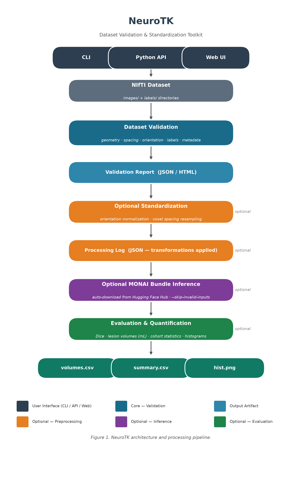

# Summary

NeuroTK is an open-source Python toolkit designed to help researchers and
clinicians check the quality of brain imaging datasets before they are used in
scientific studies. Brain imaging data, such as CT or MRI scans, are often
collected from multiple sources and may contain hidden inconsistencies that can
affect research results. NeuroTK provides automated checks to identify these
issues early and produces clear reports that document dataset quality in a
reproducible way.

The software works directly on common medical imaging files and reports
properties such as image geometry, voxel spacing, orientation consistency, and
the presence of annotations. NeuroTK can also optionally standardize datasets in
a controlled and auditable manner. By making dataset quality visible and
documented, NeuroTK helps researchers avoid downstream errors and improves the
transparency of imaging-based research.

# Statement of need

Brain imaging datasets used in neurology research are frequently heterogeneous.
Differences in scanners, acquisition protocols, reconstruction pipelines, and
clinical workflows often lead to inconsistencies in voxel spacing, orientation,
affine matrices, and annotation completeness. These issues are typically
discovered only after significant effort has been invested in preprocessing,
model development, or analysis, at which point correcting them can be costly or
impractical.

Most existing medical imaging software focuses on model training, inference, or
image preprocessing, and generally assumes that input datasets are already
well-formed and standardized. NeuroTK addresses a distinct gap by focusing
explicitly on dataset validation and quality assurance as a first-class research
task. The software is intended for researchers releasing datasets, conducting
benchmarking studies, or preparing imaging data for reproducible analysis. By
producing structured validation artifacts, NeuroTK enables transparent
documentation of dataset quality and supports reviewer and collaborator
confidence.

# State of the field

Several widely used medical imaging frameworks provide utilities for data
loading and preprocessing, including MONAI [@monai], nnU-Net [@isensee2021nnu],
and SimpleITK-based pipelines [@simpleitk]. These tools are primarily optimized
for downstream modeling workflows and typically embed validation logic implicitly
within preprocessing or training code. As a result, dataset quality checks are
often ad hoc, undocumented, or tightly coupled to specific modeling assumptions.

NeuroTK adopts a complementary approach by decoupling dataset validation from
modeling and task-specific preprocessing. Rather than extending an existing
training framework, NeuroTK provides a lightweight, standalone toolkit focused
on explicit inspection, reporting, and controlled standardization. This design
supports use cases such as dataset release audits, benchmarking pipelines, and
cross-study comparisons where transparent documentation of dataset properties is
critical. The decision to build a separate tool reflects the need for a
model-agnostic, auditable solution that existing frameworks do not directly
provide.

# Software design

NeuroTK is designed around three core principles: deterministic behavior,
explicit separation of concerns, and auditability. The toolkit provides a command
line interface and Python API that operate directly on directories of NIfTI
files [@nifti], without modifying original data. File I/O relies on NiBabel
[@nibabel] for robust cross-platform NIfTI support.

The validation component inspects image and label files for readability,
geometry, voxel spacing, orientation, affine consistency, and annotation
presence. Results are aggregated into structured JSON reports and optional
human-readable HTML summaries. The preprocessing component is optional and
explicitly invoked by the user. It performs only orientation normalization and
voxel spacing resampling, using deterministic methods and recording all
transformations in machine-readable reports. NeuroTK deliberately avoids
heuristic preprocessing, modality-specific assumptions, and learning-based
methods in order to preserve interpretability and reproducibility.

NeuroTK also supports inference via external MONAI bundles [@monai], including
automatic download from Hugging Face Hub. Post-inference utilities include Dice
score computation, lesion volume quantification (mL), cohort stratification
statistics, and histogram generation. These are accessible via the CLI or
Python API and are designed to integrate into automated research pipelines.

The toolkit provides three interaction modes:

- **CLI**: the primary interface for batch and pipeline use (`neurotk validate`,
  `neurotk preprocess`, `neurotk infer`, `neurotk dice`, `neurotk lesion-volume`)
- **Python API**: all CLI commands are importable functions for programmatic use
- **Web UI**: a FastAPI-based web application for interactive use without
  command-line knowledge, supporting single-dataset upload and report generation

Figure 1 illustrates the end-to-end architecture and processing pipeline,
showing how each interaction mode feeds into the validation, optional
standardization, optional inference, and evaluation stages.



A Dockerfile is provided for containerized deployment. Installation requires
only `pip install neurotk`; inference extras are opt-in via
`pip install neurotk[inference]`.

# Quality control

NeuroTK includes a test suite of 13 modules containing over 60 test cases
covering all major subsystems: validation, preprocessing, inference, lesion
volume analysis, cohort statistics, CLI behaviour, HTML report generation, and
web application commands. Tests are implemented using pytest and use synthetic
NIfTI fixtures generated at test time, ensuring reproducibility across
environments without requiring external data.

A continuous integration pipeline (GitHub Actions) runs the full test suite on
every push and pull request across Python 3.8, 3.9, 3.10, and 3.11 on Ubuntu.
CI status is reflected by the repository badge. Regression test fixtures
(`tests/fixtures/`) pin expected JSON report schemas so that format changes are
detected automatically.

Key test coverage areas include:

- **Validation correctness**: verified against datasets with missing labels,
  corrupt NIfTI files, spacing inconsistencies, and orientation mismatches
- **Preprocessing determinism**: outputs verified to match expected spacing and
  orientation for fixed inputs
- **Inference pipeline**: MONAI bundle loading, skipping of invalid inputs, and
  Dice computation verified with synthetic predictions and labels
- **Report schema regression**: JSON structure and HTML output verified for
  required fields via fixture comparison
- **CLI contracts**: all CLI entry points tested for correct exit codes and
  output file creation

The software has been exercised on real CT imaging cohorts from the NIH-funded
PROTECT III traumatic brain injury study, where it was used to validate and
standardize datasets prior to deep learning model development [@rathi2026tbi].
Sample input and output data are included in the repository under `sample_data/`.

# Availability

- **Repository**: https://github.com/SakshiRa/neurotk
- **Archive**: https://doi.org/10.5281/zenodo.18252017
- **License**: Apache 2.0
- **Package**: `pip install neurotk` (PyPI)

# Reuse

NeuroTK is designed for reuse across a range of neuroimaging workflows. The
toolkit is installable via `pip install neurotk` (inference extras:
`pip install neurotk[inference]`), requires Python >= 3.8, and runs on Linux,
macOS, and Windows without GPU for validation and preprocessing tasks.

## Concrete reuse scenarios

**Dataset release auditing**: researchers preparing a public imaging dataset can
run `neurotk validate` to generate a JSON/HTML quality report to include as
supplementary material, documenting spacing, orientation, and annotation
completeness for reviewers.

**Pre-training data checks**: prior to training a segmentation model with MONAI
[@monai] or nnU-Net [@isensee2021nnu], users can run `neurotk validate` to
detect geometry inconsistencies that would silently degrade training.

**Post-inference analysis**: after running segmentation with a tool such as
BLAST-CT [@monteiro2020], `neurotk lesion-volume` quantifies lesion burden
per case and generates cohort-level statistics and histograms.

**Benchmarking pipelines**: challenge organizers can use NeuroTK to validate
that submitted datasets meet geometric consistency requirements before
evaluation.

## Python API usage

All CLI commands are importable as Python functions, enabling programmatic
integration into larger pipelines:

```python
from neurotk.validate import validate_dataset
from neurotk.preprocess import preprocess_dataset

report = validate_dataset(images_dir="data/images", labels_dir="data/labels")
print(f"Files with issues: {report['summary']['files_with_issues']}")

preprocess_dataset(
    images_dir="data/images",
    output_dir="data/preprocessed",
    target_spacing=(1.0, 1.0, 1.0),
    target_orientation="RAS",
)
```

## Continuous integration example

The CLI is designed for headless use in CI pipelines. The following GitHub
Actions step validates new data contributions before merging:

```yaml
- name: Validate dataset
  run: |
    pip install neurotk
    neurotk validate --images data/images --out report.json
    python -c "
    import json, sys
    r = json.load(open('report.json'))
    if r['summary']['files_with_issues'] > 0:
        print('Dataset has issues'); sys.exit(1)
    "
```

## Batch processing

For cohorts with hundreds of scans, NeuroTK supports batch inference via input
lists:

```sh
find data/images -name '*.nii.gz' > inputs.txt
neurotk infer --input-list inputs.txt --output-dir predictions/ --device cuda
neurotk lesion-volume --preds predictions/ --output volumes.csv \
    --summary-output summary.csv --histogram hist.png
```

## Extension

NeuroTK's validation and preprocessing components are importable as a Python
library. Researchers can extend the validation schema by adding custom check
functions to the validation pipeline. The JSON report format is documented and
stable across minor versions, enabling downstream tooling to parse and aggregate
reports across studies.

# Support

Support for the software is provided via the following channels:

- **GitHub Issues**: https://github.com/SakshiRa/neurotk/issues — bug reports
  and feature requests are tracked here using provided issue templates.
- **Contributing guide**: `CONTRIBUTING.md` documents how to set up a
  development environment, run the test suite, and submit pull requests.
- **Maintainer contact**: Sakshi Rathi (rathi036@umn.edu) actively monitors
  issues and pull requests. Bug reports are typically acknowledged within one
  week.

# Research impact statement

NeuroTK is intended to function as research infrastructure for neurology brain
imaging studies and dataset-centric workflows. The software is distributed via
PyPI and archived with a permanent DOI, enabling citation and reuse. NeuroTK has
been designed to integrate into automated pipelines, continuous integration
systems, and dataset release processes, providing concrete quality assurance
artifacts that can be included in supplementary materials or reviewer-facing
documentation.

Early adoption has focused on internal research workflows and benchmarking
pipelines, where NeuroTK has been used to detect dataset inconsistencies prior to
model development. The availability of structured validation reports, optional
standardization, and human-readable summaries positions NeuroTK for broader
adoption in reproducible neuroimaging research and educational settings.

# AI usage disclosure

Generative AI tools were used during the development of this project to assist
with software engineering tasks and manuscript preparation. Specifically, large
language models (ChatGPT, OpenAI GPT-5.x series) were used to assist with code
scaffolding, refactoring, test generation, documentation drafting, and
copy-editing of the manuscript text. All AI-assisted outputs were reviewed,
edited, and validated by the author. The core software design, implementation,
and scientific framing decisions were made by the author, who takes full
responsibility for the correctness and integrity of the software and manuscript.

# Acknowledgements

The author acknowledges support from academic collaborators and open-source
communities that provided feedback during development and testing of the
software.

# References
